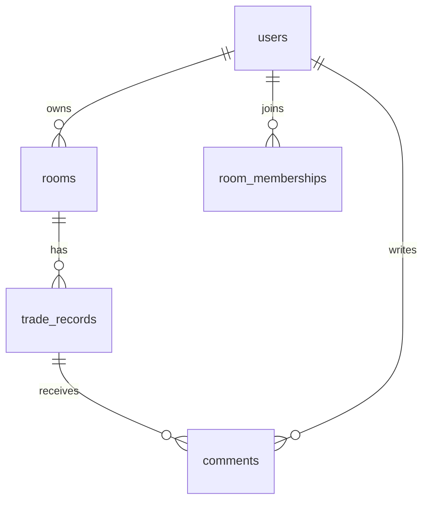

# 股神俱樂部 API Scaffold (Laravel 10)

> 注意：此環境無法下載 Packagist 套件，`composer install` 需在可連線的環境執行；本專案已提供路由、模型、遷移、種子與測試雛形。

## 環境設定
1. 安裝 PHP 8.1+、Composer。
2. 在可連線網路的環境下執行：
   ```bash
   composer install
   cp .env.example .env
   php artisan key:generate
   touch database/database.sqlite
   php artisan migrate --seed
   php artisan serve
   ```
3. JWT：執行 `php artisan jwt:secret` 產生 `JWT_SECRET`。

## API 路由表 (部分)
| Method | Path | 功能 | 範例 Request | 範例 Response |
| --- | --- | --- | --- | --- |
| POST | /auth/register | 註冊 | `{ "email": "demo@example.com", "phone": "0911111111", "nickname": "達人Demo", "password": "secret", "passwordConfirm": "secret" }` | `201 {"token": "<jwt>", "user": {"id": "..."}}` |
| POST | /auth/login | 登入 | `{ "email": "demo@example.com", "password": "secret" }` | `200 {"token": "<jwt>", "user": {"id": "..."}}` |
| GET | /rooms | 房間總覽 | `Authorization: Bearer <token>` | `200 [{"id": "room-1", "name": "短線波段房", "memberCount": 88}]` |
| POST | /rooms | 創建房間 | `{"name":"DEMO","cycle":"short_term","intro":"示範"}` | `201 {"id":"room-new","memberCount":1}` |
| POST | /rooms/{id}/join | 加入房間 |  | `200 {"status":"joined"}` |
| POST | /rooms/{id}/trades | 新增操作記錄 | `{"symbol":"2330","name":"台積電","shares":10,"date":"2024-02-01","action":"buy","note":"..."}` | `201 {...}` |
| GET | /trades/{id}/comments | 取得留言 |  | `200 {"comments":[...],"total":1}` |
| GET | /me | 個人主頁 |  | `200 {"roomsCreated":[...],"roomsJoined":[...]}` |

完整定義請參考 [openapi.yaml](./openapi.yaml) 與 [postman_collection.json](./postman_collection.json)。

## 資料庫 ER 圖


## 測試雛形
- `tests/Feature` 目錄預留；可新增 JWT 驗證、房間 CRUD、操作記錄 CRUD、留言流程的 API 測試。

## 種子資料
- `DatabaseSeeder` 會建立 1 個達人帳號、1 個房間與 10 筆操作記錄，方便前端驗證列表與排序。
